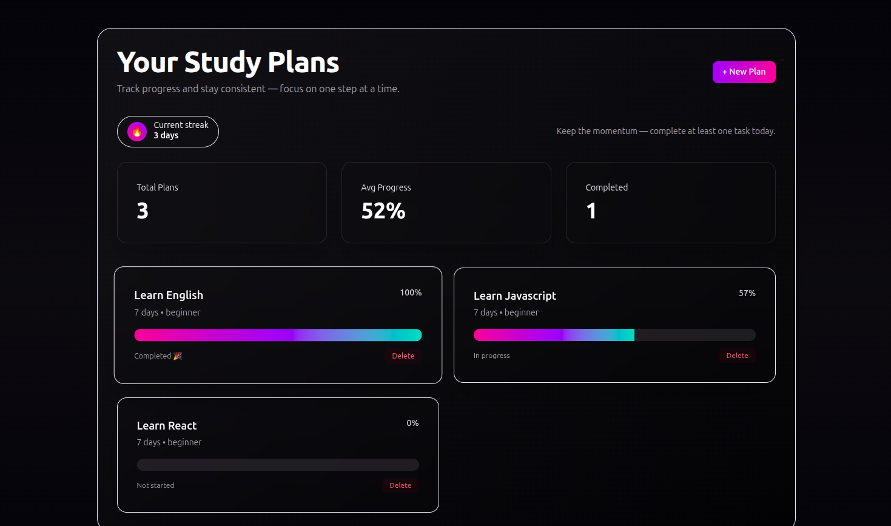
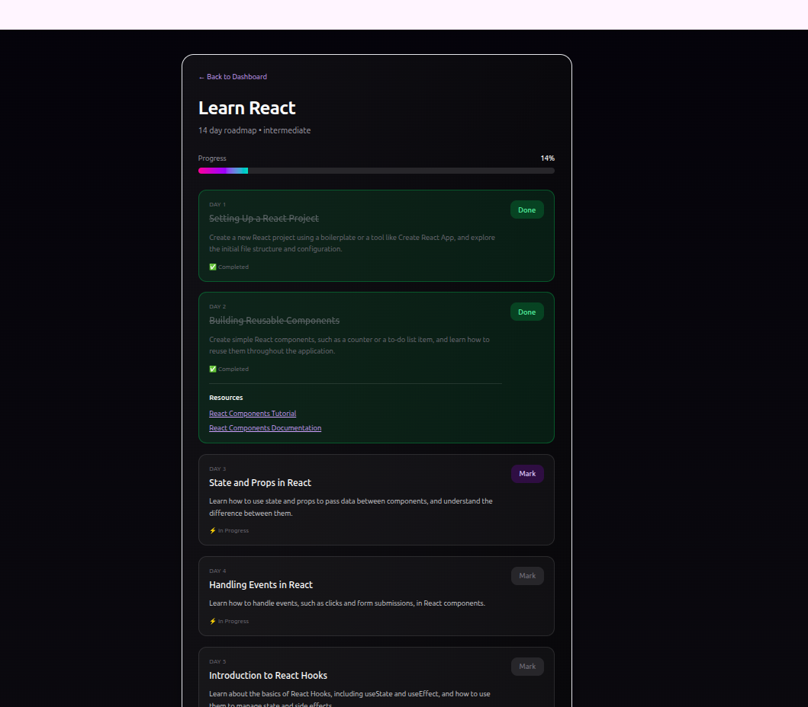
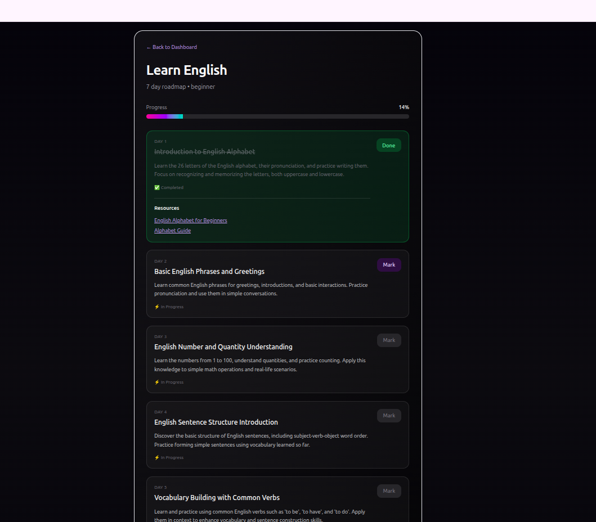
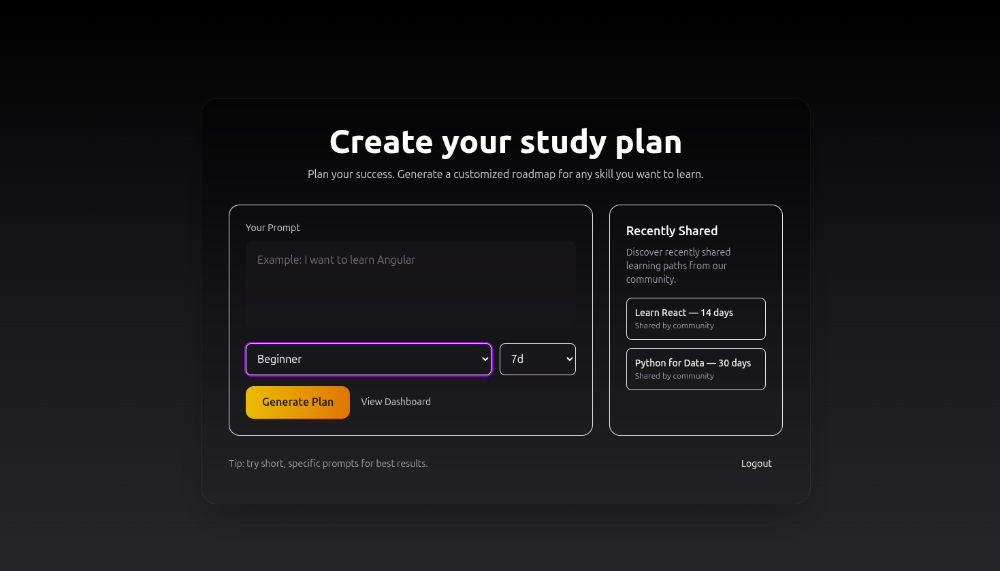

# AI Study Planner

An AI-powered full-stack learning roadmap application built with **Next.js 16**, designed to generate personalized study plans, structured learning paths, intelligent resources, and real-time progress tracking.

Users can create custom roadmaps for any topic — from React and System Design to Psychology and Languages — and follow guided AI-generated learning journeys with sequential progression, resource recommendations, analytics, and progress visualization.

---

# Features

## AI-Powered Roadmap Generation

- Dynamic AI-generated learning paths
- Personalized study plans based on:
  - goal
  - difficulty level
  - duration
- Different roadmap structures for different topics
- Intelligent progression from beginner to advanced concepts
- Topic-aware task generation
- AI-generated explanations and learning objectives
- AI-generated learning resources

---

## Smart Resource System

- AI generates:
  - YouTube learning resources
  - documentation/article resources
- Safe URL generation system
- No hallucinated/broken links
- Automatic:
  - YouTube search links
  - Google/docs search links

---

## Authentication

- Google OAuth authentication using NextAuth
- User-isolated dashboards
- Secure session-based APIs
- Protected routes and ownership validation

---

## Study Plan Management

- Create personalized roadmaps
- User-specific plans
- Duplicate plan prevention
- Delete plans securely
- Expandable task cards
- Detailed task explanations

---

## Sequential Learning System

Tasks must be completed in order.

Example:
- Day 4 remains locked until Day 3 is completed

This creates:
- guided progression
- realistic learning flow
- meaningful progress tracking

---

## Real-Time Progress Tracking

- Instant task updates
- Optimistic UI rendering
- Real-time progress bars
- Completion percentage tracking
- Active/in-progress/completed states

---

## Dashboard Analytics

- Total plans
- Average progress
- Completed plans
- Active plans
- Real-time analytics updates

---

## Modern UI/UX

- Fully responsive layout
- Product-style dark UI
- Glassmorphism-inspired cards
- Smooth animations and transitions
- Expandable roadmap sections
- Interactive progress tracking
- Loading + empty states

---

# Tech Stack

## Frontend

- Next.js 16
- React
- TypeScript
- Tailwind CSS

---

## Backend

- Next.js API Routes
- MongoDB
- Mongoose

---

## Authentication

- NextAuth.js
- Google OAuth

---

## AI Integration

- Groq API
- Llama 3.3 70B Versatile

---

## Deployment

- Vercel
- MongoDB Atlas

---

# Key Engineering Decisions

## AI + Safe URL Architecture

Instead of trusting AI-generated URLs directly, the system:

1. AI generates:
   - resource title
   - search query
   - resource type

2. Application safely generates valid URLs

This prevents:
- broken links
- hallucinated URLs
- invalid resources

---

## User-Isolated Architecture

Every plan is tied to the authenticated user.

This ensures:
- protected dashboards
- secure CRUD operations
- isolated data access
- ownership validation

---

## Sequential Task Locking

Roadmaps behave like guided learning systems.

Users cannot skip ahead randomly, improving:
- roadmap integrity
- learning consistency
- meaningful progression

---

## Optimistic UI Updates

Task completion updates instantly on the frontend before full server refetches.

This creates:
- faster UX
- smoother interaction
- real-time feel

---

# Getting Started

## 1. Clone Repository

```bash
git clone https://github.com/LaibaFirdouse/StudyPlanner
cd StudyPlanner
```

---

## 2. Install Dependencies

```bash
npm install
```

---

## 3. Setup Environment Variables

Create a `.env.local` file:

```env
MONGODB_URI=your_mongodb_uri

GOOGLE_CLIENT_ID=your_google_client_id
GOOGLE_CLIENT_SECRET=your_google_client_secret

NEXTAUTH_SECRET=your_secret
NEXTAUTH_URL=http://localhost:3000

GROQ_API_KEY=your_groq_api_key
```

---

## 4. Run Development Server

```bash
npm run dev
```

---

# AI Resource Flow

```txt
User Goal
   ↓
AI Generates Roadmap
   ↓
AI Returns:
- title
- description
- resource queries
- resource types
   ↓
Application Generates Safe URLs
   ↓
Interactive Learning Experience
```

---

# Future Improvements

- AI mentor chat
- “Explain this task” AI assistant
- Adaptive difficulty system
- Personalized learning recommendations
- Weekly AI-generated review summaries
- Calendar integrations
- Habit/streak psychology engine
- Smart roadmap regeneration
- Notes and bookmarking
- Vector memory / long-term learning memory
- Mobile app version

---

# Deployment

The application is deployed on **Vercel** with MongoDB Atlas as the primary database backend.

---

# Screenshots

## Dashboard



---

## AI Study Plan





---

## Authentication



---

# Author

## Laiba Firdouse

Frontend-focused full-stack developer passionate about building polished products, intelligent user experiences, and scalable modern web applications.